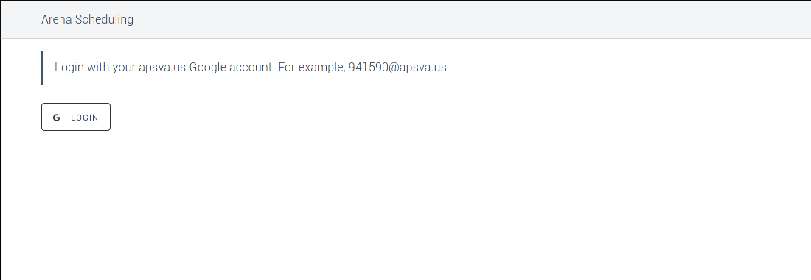
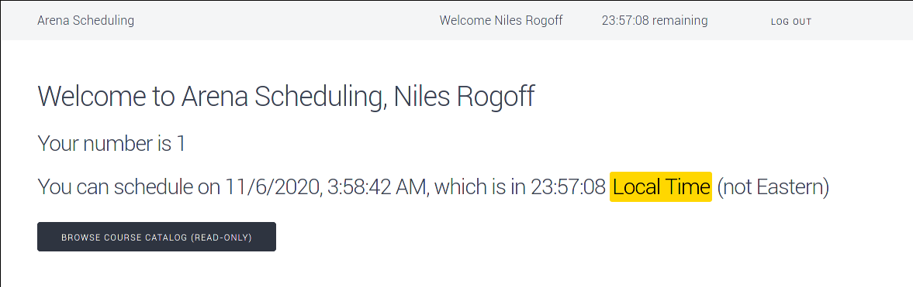
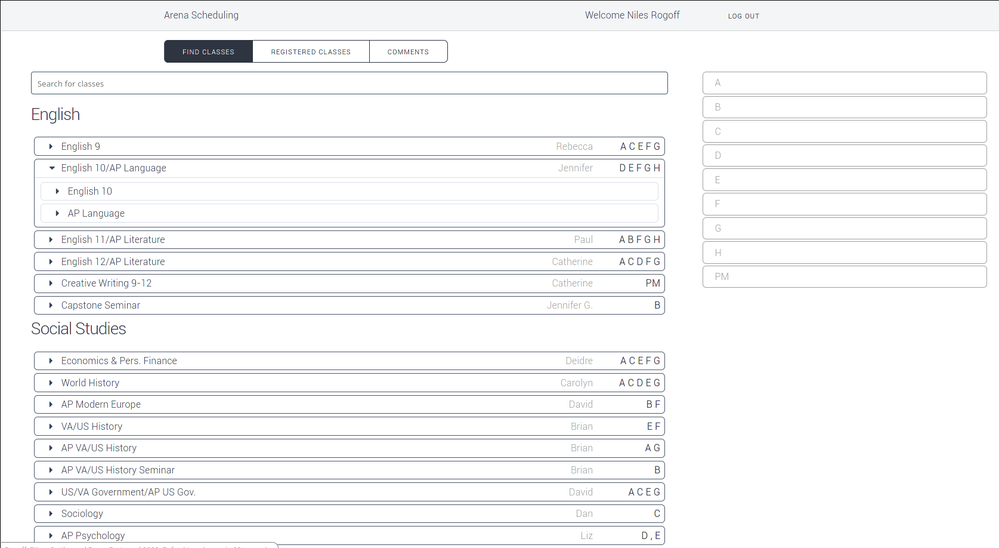
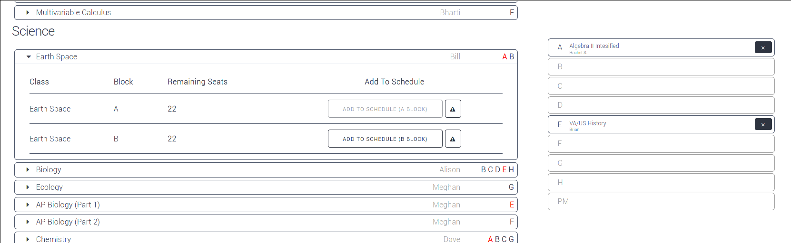
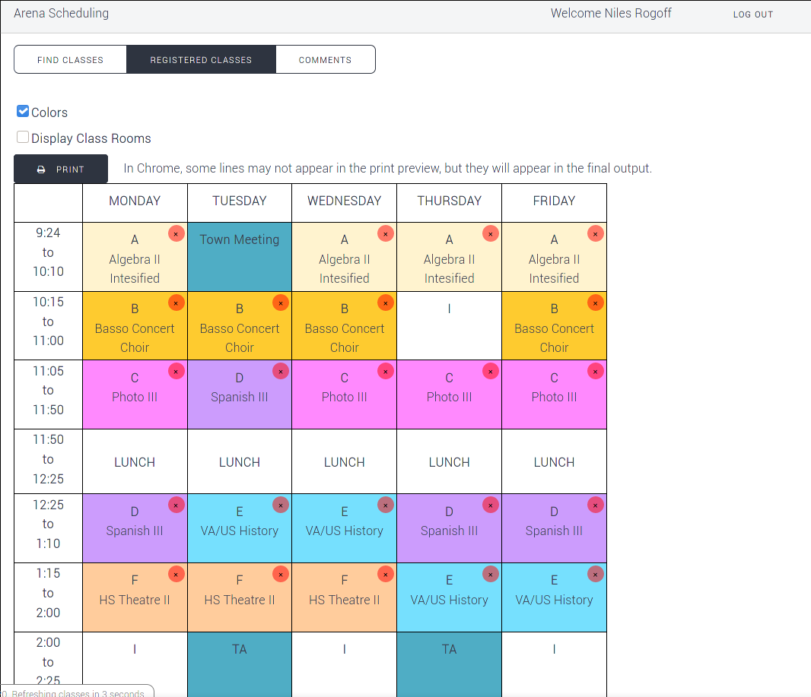
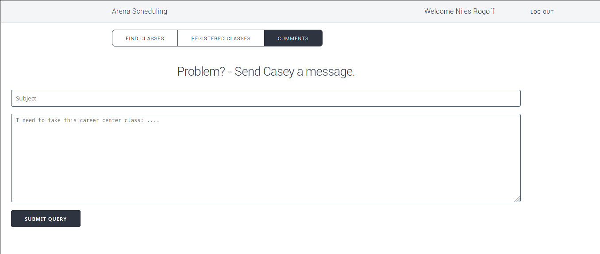
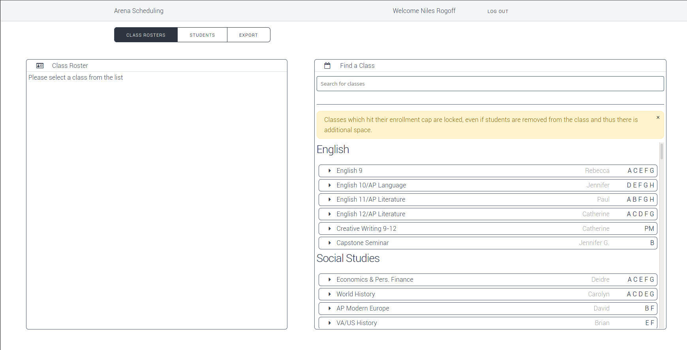
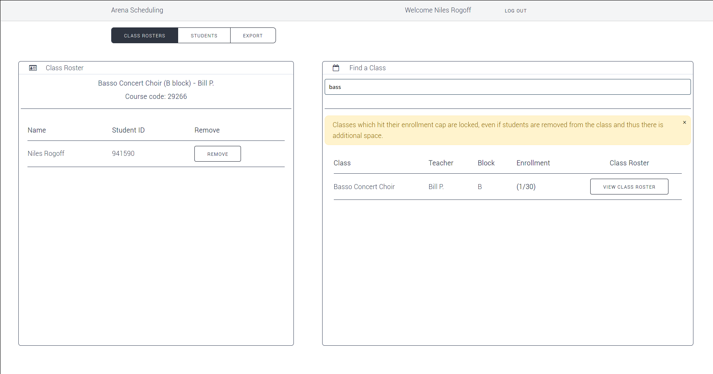
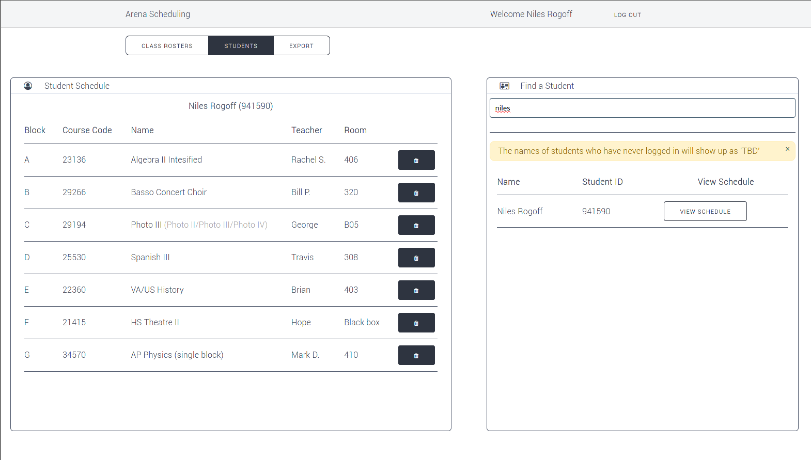
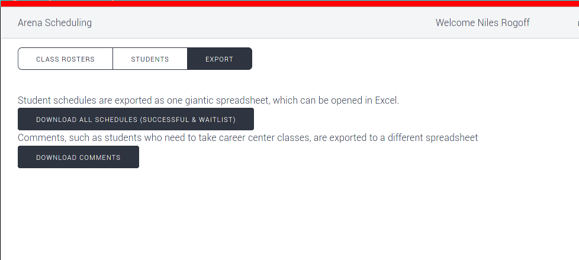

# Arena Scheduling

## Background

Arena Scheduling is H-B Woodlawn's system for letting students sign up for the classes they will be in the next year.

Each student is given 11 stickers with their name and student number on them. Around the gym are teachers, and each teacher has a sheet of paper for each class they are offering. That sheet of paper has a certain number of sticker-sized rectangles on it. To sign up for a class, a student places their sticker in that rectangle. If there are no rectangles remaining, the class is full, and the student can write their name in the space on the side to waitlist themselves (which must be handled manually by the teacher/principal), or re-arrange their schedule so they can take the class at a different block (period). This re-arranging may require that they also move classes they already signed up for to a different block, so they may have to "remove" their sticker (by crossing it out).

Each student is given a number, and that determines the order in which they get to enter the gym. Lower numbers go first, so if you are number 1, you can likely sign up for all the classes you need before they fill up. If you get in later, you might want to rush to the important tables for your schedule, for example, if your schedule will fall apart if you can't take Biology at B block, you will want to visit the sciences table first before anything else. Similarly if you need to get into a class that you predict will be in high demand at a particular period.

Numbers are unique per grade. Rising seniors enter first, in number order, then juniors, then sopohmores. Rising freshmen have their schedules determined by the middle school principal (or the principal).

This project is a re-creation of the real arena scheduling via a webapp, due to covid-19. 

## Screenshots

### Login

### Student interface

### Admin interface

## Technical overview

Runs on bottle.py, with a sqlite database (`schedule.db`) as a backend. The database will create itself if you start the server with no data. 

This was not written to be efficient, it was only ever meant to handle a few hundred classes and a few thousand students. For 2020, we ran it on a m5.medium ec2 instance (or something similar)

### Data model

The original plan was to use the name and block of each class as a composite primary key. So if Photo was offered at three blocks, it would have three rows, (Photo, C), (Photo, D) and (Photo, H). Each row would have an associated cap (maximum number of students who can be in the class), as well as a teacher, room number, course code, and any other associated metadata that might be helpful after export. PM block is represented as "P"

Unfortunately we had the problem that there can be multiple subsections of each class, such as "English 12/AP Literature". We want to keep track of which class the student signed up for (12 or Lit), but we also want them to share a single cap. So then the composite primary key was (Name, Subsection, Block). 

Then we ran into another error trying to import the schedule that was used in 2019 for testing, where the same class was taught at the same block by two different teachers (in this case, economics). 

So now the primary key for classes is (Name, Subsection, Block, Teacher), and a ton of functions have to take and return these big tuples. 

The tables used in scheduling are:

- `classes` (as described above)
- `students` (one row per student, see "authentication and user data")
- `student_schedules`, each row has a student id and a class primary key.

There is additionally a view that returns all the rows in classes, with an added derived column that is the number of remaining slots in the class (computed from the cap in `classes` and the number of matching rows in `student_schedules`)

There are also a few tables for comments and waitlisted students and stuff - they can be removed if you want to adapt this to a different use.

### Locked classes

Users can waitlist themselves for a class, but it's a manual process that the principal has to intervene in to fix the student's schedule, and it doesn't take place until after arena scheduling is finished.

Ethan pointed out that if someone had to waitlist themselves for a class, then someone in the class dropped it, and someone else took the spot before the waitlisted person could add it for real, then they would be pretty upset. We didn't want to deal with the nightmare of migrating people from the waitlist onto the real schedule when someone drops, so to fix this problem, once a class is full, it "locks", and people can still drop it, but even if people drop it and it has free spaces, nobody else can add it (only waitlist).

### Authentication and user data

Users login via OAuth with their google accounts. The @apsva.us suffix is stripped off, and the bits before it are used as the student ID. If it looks like a number, they're a student, and if it has any other characters, they're a teacher. 

If they are a teacher, and no row exists in `students`, a row is created for them on first login.

If they're a student, and no row exists in `students`, the login is denied. If the row exists, their name is updated to be the name returned from their google account (replacing the "TBD" string from the initial import)

Teachers have full admin rights and can remove any student from any class. This is needed for some corrections.

To set up google authentication, you need to go to the google developer console and press buttons. Just follow step 1 [here](https://developers.google.com/identity/protocols/oauth2). Steps 2 thru X are done by the code in oauth.py and don't require any manual intervention. Put your client secret into a file called `client_secret.txt` and the server might start. If you actually created a new google thingy for it, you'll also need to put your client id in `oauth.py`. You ALSO need to update the `REDIRECT_URI` in oauth.py to run the server on anything other than localhost:8080. The URI you put in there NEEDS to be accessible to anyone who is going to log in.

### Modifying the javascript

The app takes forever to load in development mode, so at the last minute I fucked some shit together and now there's a makefile. It needs npm because of course it does, and if you add a new js file, you need to add it to the `ORDER` variable at the top of the file. You can't just replace that variable with a recursive glob or something because the files need to appear in a way that preserves dependencies. It's fragile.

Anyways the files are transpiled to some super old version of javascript that even IE9 can read in the "lib" folder, then cat'd together to make final.js, then final.js has all the whitespace removed and variables renamed to make `final.min.js`, which is actually included by index.html

index.html also loads fontawesome asynchronously because it makes the initial pageload way faster. Hope that never comes back to bite us.

### Exporting the data

The final export of all the student schedules is actually a union of both the `student_schedules` table and the waitlist table, waitlisted entries are tagged with an additional WAITLIST column somewhere.

### Running the app

- `pip install -r requirements.txt`
- Set up oauth in `client_secret.txt` and `oauth.py` as described in "authentication and user data"
- `python app.py`

The app will now probably be running at `localhost:8080` with no users and no classes.

### Importing data

You can import them using the other scripts in the root of the repository (`import.py` for classes, `student_importer.py` for students). These importer scripts expect the input in a certain format which is mostly just a trimmed-down version of the spreadsheet used for the class schedule, with consecutive blank lines and useless columns removed. Example:

	21XXX,"English 9","Rebecca","A; C; E; F; G ",414,22
	"21XXX/31XXX","English 10/AP Language","Jennifer  ","D; E; F; G; H",401,22
	31XXX,"English 11/AP Literature","Paul","A; B; F; G; H",302,22
	"31XXX/21XXX","English 12/AP Literature","Catherine","A; C; D; F; G",301,22
	21XXX,"Creative Writing 9-12","Catherine","PM",301,18
	26XXX,"Capstone Seminar","Jennifer G.","B",402,18
	,,,,,
	22XXX,"Economics & Pers. Finance","Deidre","A; C; E; F; G",401,20

Columns are:

- course code, optionally broken down into subsections with "/"
- full course name, broken down into subsections with "/"
- teacher
- blocks offered
- room number
- cap (maximum number of students)

Empty columns indicate a move to the next category. The categories are in `js/categories.js`

Class names with slashes in them indicate subsections. For example, the first row will create 5 rows in `classes` (one for each block, A, C, E, F and G). Each row will have the name "English 9" with subsection "" and the course code 21XXX.

However the second row will create 10 rows, 2 for each block. Each row will have the name "English 10/AP Language", and will EITHER have a subsection of "English 10" and course code of 21XXX, or a subsection of "AP Language" and a subsection of 31XXX. If the course code does not have slashes in it, the same code is used for all subsections.

Spaces and semicolons are ignored in the list of blocks, but commas aren't (yes, we accidentally created a class offered at the block ",")

If you have classes named "AP Chemistry (Part 1)", "AP Chemistry (Part 2)", or "AP Biology (part 1)" and "AP Biology (Part 2)", then the website will loudly complain if someone is in an odd number of them. This will hopefully alert people if they add part 1 without part 2, but technically it will stop complaining if you add bio 1 and chem 2, or vice versa. I trust hb students to figure it out.

Student importing is eaiser. Each row looks like this

    12,941590
	10,941720
	10,95XXXX
	10,95XXXX

The first column is the grade, second column is student number. The importer shuffles and assigns a number to every student (in groups of their grade). The first number is actually 0, so the number is incremented when we display it in the UI. Then it determines the time the student should be allowed in based on the assigned number. There are two tweakable parameters, the time at which the first student is to be allowed in (`base_time`), and the number of seconds between students (`tdeltasec`, value we used was 3 minutes). So the first senior is let in at exactly `base_time`, then the next senior is let in 3 minutes after that, and so on. The first junior is let in exactly 24 hours after the first senior, and the second junior is let in 3 minutes after that, and so on (thus each grade takes one day to complete).

The student importer script is deterministic for a given input, so it is safe to run multiple times when you are testing stuff out (assuming you wipe the database between runs). However if you add more students the output will change.

Since I really don't want you to mess this up, the starting time for arena scheduling (`base_time` at the top of `student_importer.py`) is in unixtime. Don't trust most online converters! They will frequently display the time in UTC which is really annoying, especially since I was programming this while in UTC-8 and the school was is in UTC-5. If you open the script now, you can see the last value we used was 1591624800. The easiest way to see when that was or will be is to go to http://time.is/1591624800 , literally just paste the unixtime after http://time.is/. For me, this shows:

	07:00:00AM on Monday, June 8, 2020 in Seattle, Washington, United States
	150 days ago

The "150 days ago" part is the bit that will likely be the most helpful when you are trying to make sure you have the correct time in there before running the script. For dates in the near future it will display something like "in 13 days" which will at least tell you if you have the day right. On the upper line it displays the time in the LOCAL time, so for me it shows 7 a.m. seattle time, and we were planning on starting at 10 a.m. eastern, so this was the correct time. 

To generate the correct time, you can take the current unixtime ([https://time.is/Unix\_time\_now](https://time.is/Unix_time_now)), and round down to the nearest multiple of 3600 (number of seconds in one hour). Then you can add and subtract days in increments of (3600×24), and add and subtract hours in increments of 3600 until you arrive at the time you want the first senior to be let in to arena scheduling. Then run this number by the scheduling committe just to make sure it's okay.
